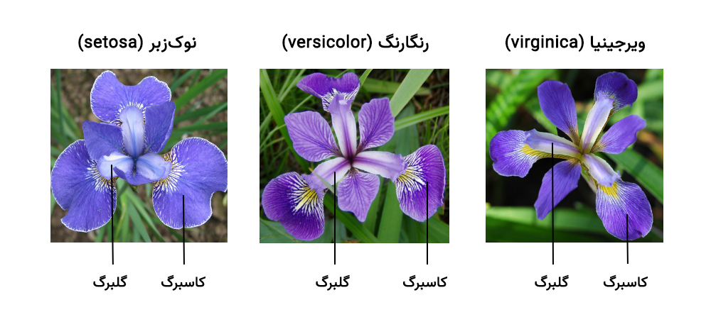
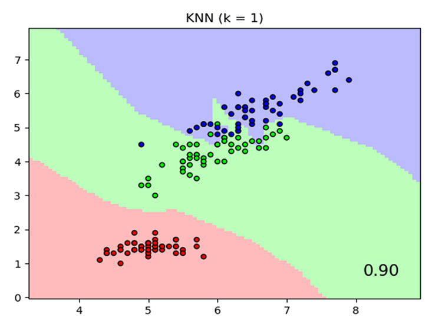

🌸 Iris Flower Classification using K-NN Algorithm

This project implements a simple yet powerful machine learning model to classify iris flowers into one of three species — Setosa, Versicolor, and Virginica — using the K-Nearest Neighbors (K-NN) algorithm. The Iris dataset is a classic in the field of machine learning and pattern recognition, often used to introduce supervised learning.

📌 Project Overview
 • Algorithm Used: K-Nearest Neighbors (K-NN)
 • Dataset: Iris Dataset (from UCI Machine Learning Repository / scikit-learn)
 • Objective: Predict the species of an iris flower based on its sepal and petal dimensions.

🔍 How K-NN Works

The K-NN algorithm classifies data points based on the majority class among the k closest points in the feature space. It is a lazy learner, meaning it stores all training data and performs computation at prediction time.

📈 Model Evaluation

Metrics used:
 • Accuracy
 • Confusion Matrix